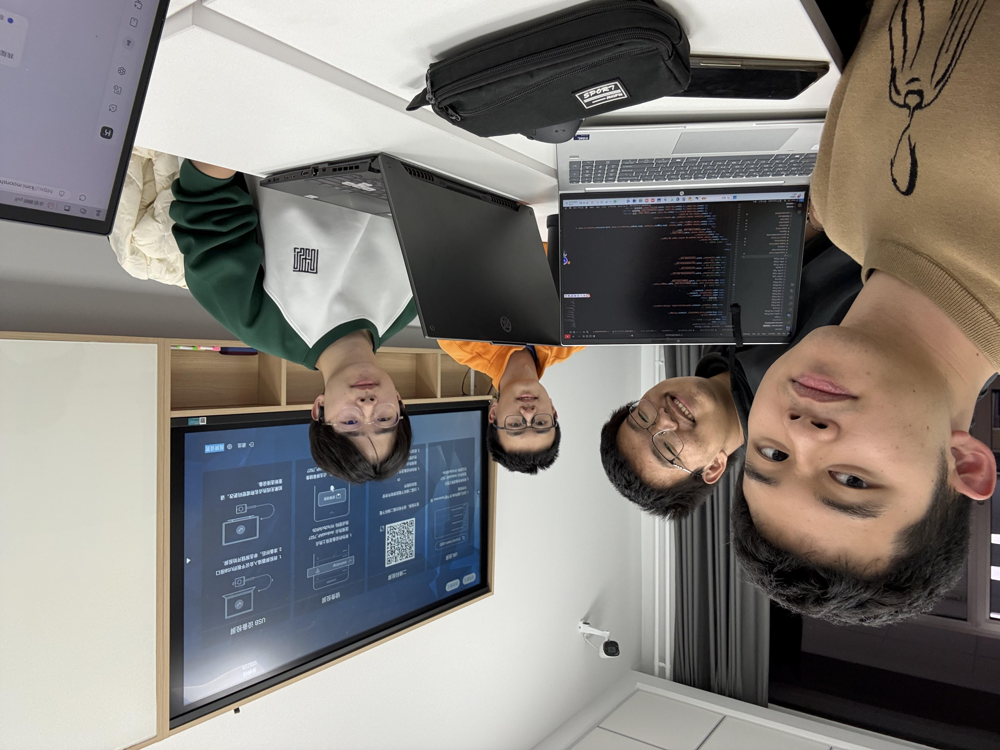
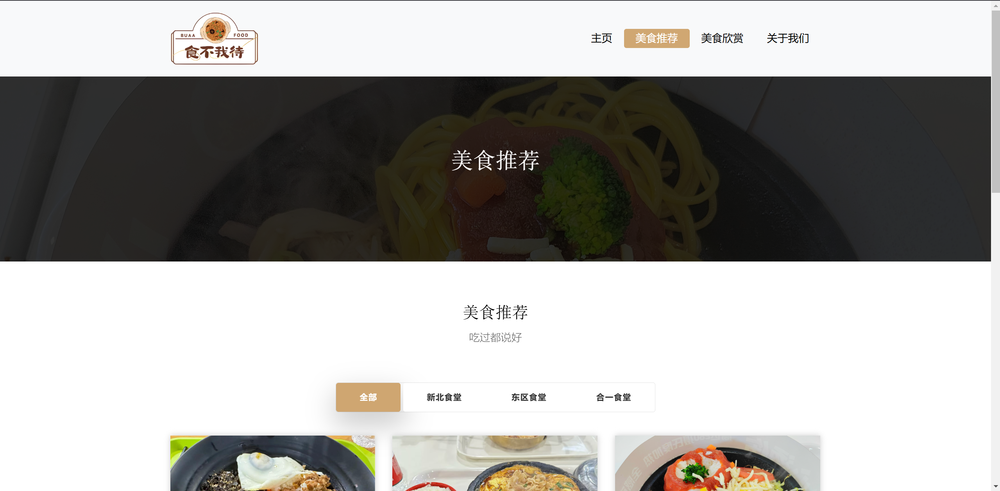
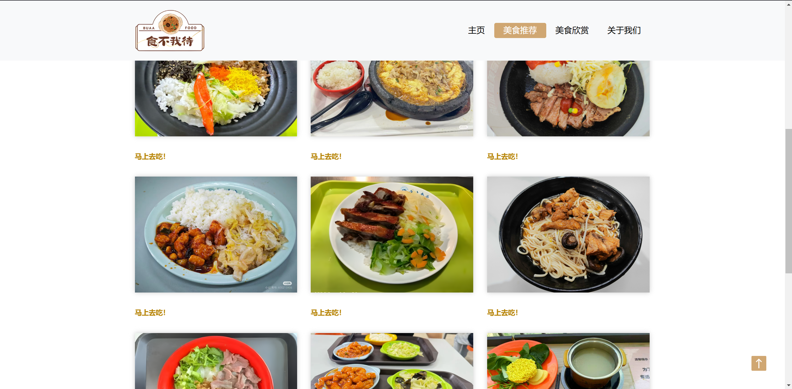
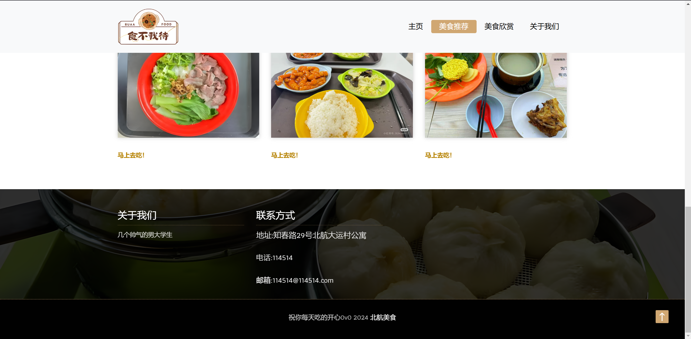
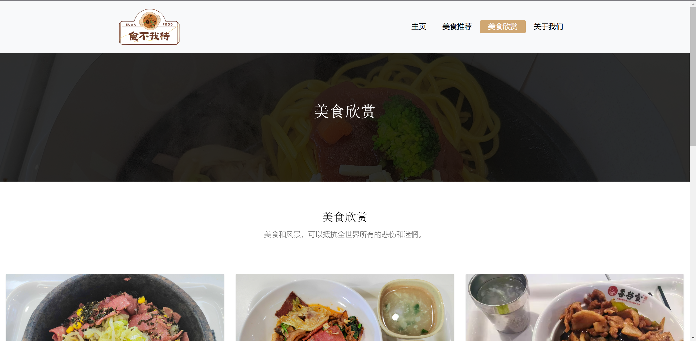
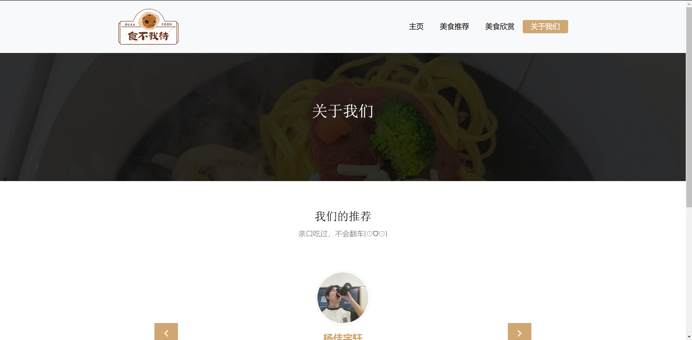
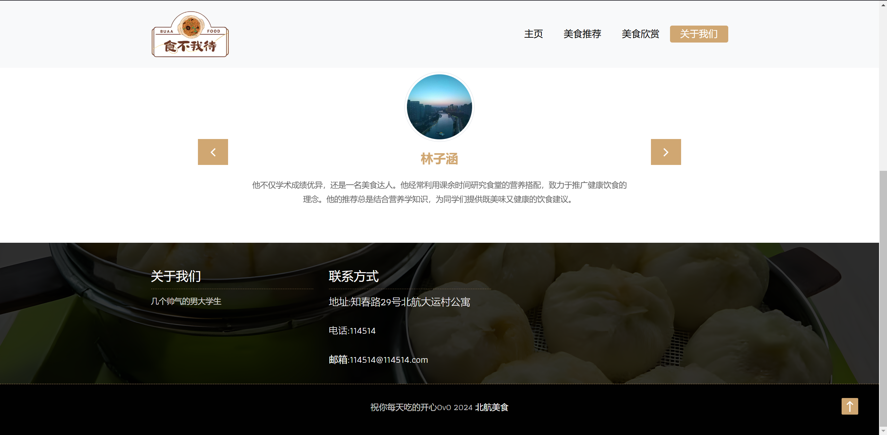

# Delicious BUAA

> 仓库地址：[DeliciousBUAA](https://github.com/DeNeRATe-cool/DeliciousBUAA)
>
> 网页链接：[食不我待](https://denerate-cool.github.io/DeliciousBUAA/)

## 团队合影🥳

## 项目介绍

​	学院路之大，美食之多，每顿饭前是否都在想吃什么？

​	有了“食不我待”，**点击**即可知道美食地点，导航带你抵达，再也不用愁吃什么了！

## 网站展示

### 首页

### 美食推荐

### 美食欣赏

### 关于我们

## 项目技术要点

**百度地图：**

- 使用 `` 链接指定图片美食到百度地图中的地点，用户可以选择导航直接前往。

**轮播图**：

- 使用了 `jquery.superslides.min.js` 实现图片轮播功能
- 结构上通过 `<ul class="slides-container">` 和 `
` 定义了轮播图内容和导航按钮

**响应式设计**：

- 加载了 Bootstrap 的 CSS 文件（`bootstrap.min.css`），并设置了 `<meta name="viewport">` 以支持移动设备上的响应式布局

**导航栏**：

- 使用 Bootstrap 提供的导航栏组件（`navbar`）实现菜单栏，可在小屏幕上折叠并通过汉堡菜单显示。

**按钮特效**：

- 使用自定义样式和 Bootstrap 按钮类，如 `btn-lg` 和 `btn-outline-new-white`，增强用户交互体验。

**图像加载与布局**：

- 使用了 `images-loded.min.js` 和 `isotope.min.js`，这用于动态布局调整和优化图像加载。

**轻量级灯箱效果**：

- 引入了 `baguetteBox.min.js`，用于实现图片画廊的放大查看功能。

**回到顶部功能**：

- 页面底部提供了一个返回顶部的按钮，通过 JavaScript 实现滚动到页面顶部的功能。

## 分工

- **前端开发** —— **林子涵**
- **前端交互与动态效果** —— **杨佳宇轩**
- **api和数据管理** —— **陈华驰**
- **内容与测试** —— **蒋嘉豪**